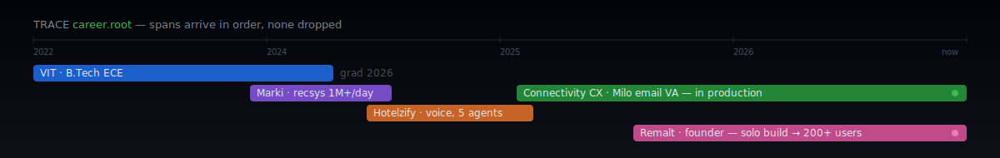
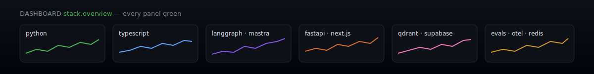

<!-- hand-built — every pixel below is hand-drawn SVG, not a widget -->



```console
rishabh@prod:~$ whoami
──────────────────────────────────────────────────────────────
   ┌─[ OK ]─┐        rishabh kumar
   │ ▓▓▓▓▓▓ │        ─────────────────────────────
   │ ▓▓▓▓▓▓ │        Role      AI Engineer · independent practice (India)
   │ ▓▓▓▓▓▓ │        Founder   Remalt — visual AI workflow builder
   └────────┘        Shell     python, typescript
  os: production     Packages  rag, voice-agents, multi-agent, evals
  alerts: 0 missed   Motto     a green health check is not proof of life
──────────────────────────────────────────────────────────────

rishabh@prod:~$ cat ./impact.log
[OK] milo email VA .............. in production · multi-tenant RAG · P50<500ms
[OK] hotelzify voice ............ 5 agents · 1M+ embeddings · 98% retrieval
[OK] remalt.com ................. solo build ──▶ 10k+ users · AppSumo launch
[OK] marki recsys ............... 1M+ preds/day @ 45ms · +28% engagement
[OK] cognidb .................... ⭐200+ · NL──▶SQL · inference cost −40%
[OK] oneticket .................. top 5 / 800+ · Smart India Hackathon
[OK] llm tracing ................ resurrected after 4 silent weeks · never again

rishabh@prod:~$ █
```





<br/>

<div align="center">

## 🟢 THE STATUS PAGE

*Every system I run, live on one board. Click a service to open its runbook.*

</div>

<details>
<summary>&nbsp;🟢&nbsp;<b>milo-agent-api</b> — autonomous email VA &nbsp;<code>uptime 99.9%</code></summary>
<br/>

> **ACK** *(page acknowledged)*
>
> Autonomous email assistant for UK automotive dealerships, built for **Connectivity CX** — reads inbound leads and replies unassisted, with a real customer on the other end.
> - 📬 Business-hours logic, follow-up scheduling, full audit trail
> - 🔍 Multi-tenant hybrid RAG — dense + BM25, RRF reranking, **per-client Qdrant isolation**
> - ⚡ **P50 < 500ms** end to end
> - 🛠️ FastAPI · Qdrant · asyncpg · GPT-4o

</details>

<details>
<summary>&nbsp;🟢&nbsp;<b>voice-gateway</b> — 5 agents on a phone line &nbsp;<code>P99 300ms</code></summary>
<br/>

> **ACK**
>
> Real-time voice support for **Hotelzify** — five specialized agents under a LangGraph supervisor, talking to hotel guests live.
> - 🎙️ Streaming Deepgram STT + ElevenLabs TTS over Plivo/Twilio, Redis Streams underneath
> - 🧠 **1M+ embeddings** in Qdrant at **98% retrieval accuracy**
> - ⏱️ **300ms P99** entity extraction — latency budgets are promises, not hopes

</details>

<details>
<summary>&nbsp;🟢&nbsp;<b>remalt.com</b> — the one where I'm the founder &nbsp;<code>10k+ users</code></summary>
<br/>

> **ACK**
>
> Visual AI workflow builder — solo-designed, solo-built, solo-shipped: [remalt.com](https://remalt.com)
> - 🎨 Infinite drag-and-drop canvas, **13 node types** (PDF, voice, YouTube, image, mindmap…)
> - 🔀 Multi-LLM routing across 9+ models · Chrome capture extension · coin-based billing
> - 🚀 Launched on **AppSumo** — 10,000+ active users and climbing
> - 🛠️ Next.js 15 · Mastra · Supabase (RLS everywhere) · xyflow

</details>

<details>
<summary>&nbsp;🟢&nbsp;<b>cognidb</b> — plain English in, SQL out &nbsp;<code>⭐ 200+</code></summary>
<br/>

> **ACK**
>
> Open-source Python library for natural-language database access: [repo](https://github.com/boxed-dev/cognidb)
> - 🗄️ One NL→SQL interface across MySQL, Postgres, MongoDB
> - 💸 Semantic caching cuts inference cost **~40%**
> - 🛡️ Constitutional-AI validation pass guards against SQL injection

</details>

<details>
<summary>&nbsp;🟢&nbsp;<b>marki-recs</b> — 1M+ predictions a day &nbsp;<code>45ms P50</code></summary>
<br/>

> **ACK**
>
> Recommendation engine for **Marki** (LA) — transformer embeddings serving real traffic.
> - 📈 **+28% engagement, +15% AOV**
> - ⚡ Real-time inference at **45ms P50**, 1M+ predictions/day
> - 🔁 Airflow ML pipeline, distributed training across 4 GPUs · vLLM · Redis

</details>

<details>
<summary>&nbsp;🟡&nbsp;<b>health-check</b> — all systems operational&nbsp;… right? &nbsp;<code>200 OK</code></summary>
<br/>

> **⚠ INCIDENT REVIEW** *(you found the one that lied)*
>
> This service returned `200 OK` every ten seconds for **four straight weeks** — while the traces it was
> supposed to guard silently died against a 404. 31,490 spans in the database; the newest one a month old.
>
> That incident became the thesis of everything I build now: **existence is not arrival.**
> "Is the container up" was true. "Is the data landing" was false — and nothing was asking.
>
> - 📝 The full story: [A wrong character in a URL killed our LLM tracing for 4 weeks](https://rsbk.cc/blog/llm-tracing-dead-4-weeks)
> - 🧰 The gates it spawned: [ship-safe-harness](https://github.com/boxed-dev/ship-safe-harness) — test/eval/deploy gates for any AI codebase
> - 🔐 The audit kit: [vibe-coding-security](https://github.com/boxed-dev/vibe-coding-security) — 47 checks to run before you tweet your launch
>
> <details>
> <summary>&nbsp;&nbsp;🗝️ one more alert in the queue…</summary>
> <br/>
>
> > *an on-call haiku:*
> >
> > *green checks, all quiet —* 🟢
> > *four weeks of traces, missing.*
> > *now I check arrivals.* 📡
>
> </details>

</details>

<br/>

<div align="center">

## 🐍 THE COMMIT CONSUMER

*It feeds nightly on the contribution graph. Uptime: 100%.*

<picture>
  <source media="(prefers-color-scheme: dark)" srcset="https://raw.githubusercontent.com/boxed-dev/boxed-dev/output/github-snake-dark.svg" />
  
</picture>

<br/><br/>

## 📡 THE PAGE THAT REACHED YOU

*Most signals get dropped, rate-limited, or lost to a dead exporter. This one arrived. That counts.*

[](mailto:rishabh.vaaiv@gmail.com)
[](https://rsbk.cc)
[](https://www.linkedin.com/in/its-rishabh/)
[](https://x.com/rispectrum)

<br/>

<sub>hand-built — drawn in raw SVG. no stats widgets were embedded in the making of this README.</sub>

</div>
