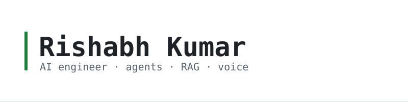

<picture>
  <source media="(prefers-color-scheme: dark)" srcset="assets/header-dark.svg">
  
</picture>

I build agents, RAG pipelines and voice AI for production.

[Website](https://rsbk.cc) · [LinkedIn](https://www.linkedin.com/in/its-rishabh/) · [X](https://x.com/rispectrum)

### Selected work

- **[CogniDB](https://github.com/boxed-dev/cognidb)** · Natural language to SQL, with guardrails.
- **[Bezel](https://github.com/boxed-dev/bezel)** · Claude Code in your Mac’s notch.
- **[Commit City](https://github.com/boxed-dev/commit-city)** · A city you can drive, built from your GitHub history.

### In the open

<a href="https://github.com/boxed-dev?tab=overview">
  <picture>
    <source media="(prefers-color-scheme: dark)" srcset="https://streak-stats.demolab.com/?user=boxed-dev&amp;hide_border=true&amp;disable_animations=true&amp;hide_total_contributions=true&amp;card_width=390&amp;card_height=170&amp;background=00000000&amp;stroke=30363d&amp;ring=f0886a&amp;fire=f0886a&amp;currStreakNum=f0f6fc&amp;sideNums=f0f6fc&amp;currStreakLabel=9198a1&amp;sideLabels=9198a1&amp;dates=9198a1">
    
  </picture>
</a>
